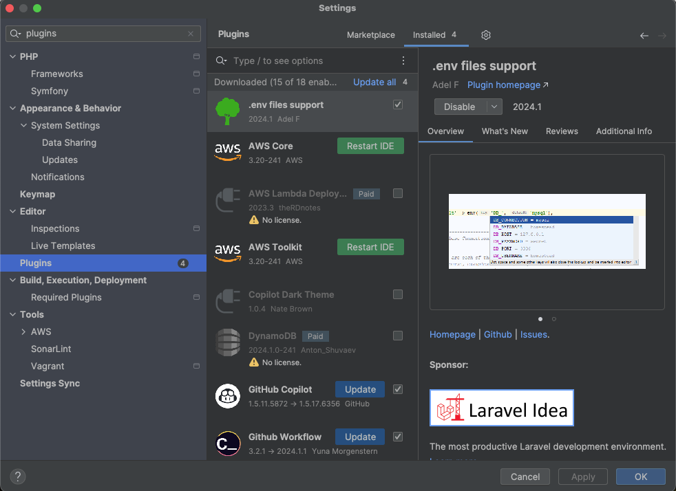
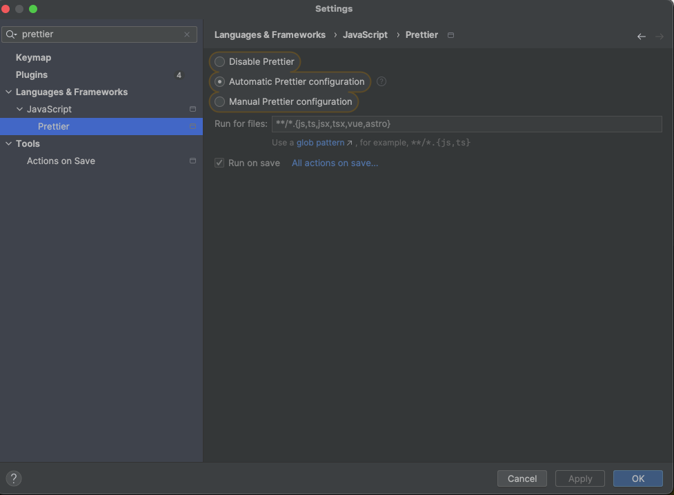

# Plugins

Depending on your preferred IDE there are useful plugins.

Useful plugins:
- [Prettier](https://prettier.io/docs/en/)
- [EditorConfig](https://editorconfig.org/)

## IntelliJ IDEA (Webstorm, PhpStorm, ...)

Install prettier:
> 

Setup prettier:
> 

## Visual Studio Code
