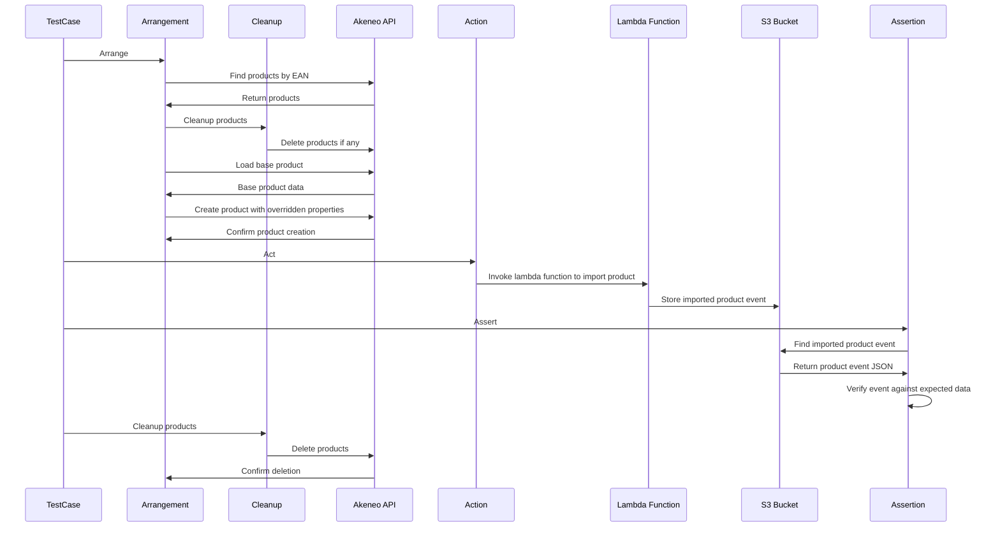

# Creating and executing tests

> See [Makefile](../Makefile) for all available commands.

List all make commands:

```shell
make
make help
```

## Configuration

General test configuration can be done in file playwright.config.ts, e.g.

- Define test directory
- Parallelism
- Define test projects / test suites
- Setup shared settings for all tests, e.g. common URL (not used in our case)
- Enable and configure reporters (see [Reports](#reports))

see [Playwright test configuration](https://playwright.dev/docs/test-configuration) for further details.

---

## Creating tests

This project utilizes end-to-end (E2E) testing with Playwright to simulate real-world scenarios and validate the
functionality of the system. Tests are structured to reflect user interactions with the application, ensuring that all
components work seamlessly together.

### Example Test Structure

Tests are organized under the `tests/` directory. Each test typically follows this pattern:

```javascript
test("Test Description", async ({ step1, step2, step3, ..., logger }) => {
  // Test implementation
});
```

- **Test Description**: Clearly describes what the test is verifying.
- **Test Steps**: Each test consists of several steps, implemented as reusable fixtures.
- **Logging**: Utilizes a custom logger for detailed logging during test execution.

---

### Reusable Playwright Fixtures

The tests leverage Playwright's fixture system to create reusable test components. These fixtures, defined
in `src/fixtures`, encapsulate specific actions, arrangements, or assertions, making the tests more modular and
maintainable.

For instance, `importSingleProductForEsnAction`, `removeExistingProductsByEAN`,
and `validateImportAgainstExpectedVariantData` are examples of such reusable fixtures.

---

### Writing a Test

When writing a new test, follow these guidelines:

1. **Define the Test Case**: Clearly state what the test is intended to verify.
2. **Use Reusable Fixtures**: Utilize existing fixtures to perform actions, setup states, and assert outcomes.
3. **Logging**: Use the provided logger to add informative log messages within your test for debugging and clarity.

---

### Implementing Actions, Arrangements, and Assertions (AAA) in E2E Testing

In our E2E testing framework, we follow the Actions, Arrangements, and Assertions (AAA) pattern to structure our tests,
promoting clarity and maintainability. This pattern is implemented through three key
interfaces: `Action<R>`, `Arrangement<R>`, and `Probe<R>`, each representing a distinct phase in the test lifecycle.

#### Arrangements

- **Purpose**: Arrangements (`Arrangement<R>`) set up the necessary state or conditions required for the test. This
  includes preparing data, configuring the environment, or any initial setup steps.
- **Implementation Example**: `GivenAProductInThePim` prepares the product data for testing. It uses a `ProductFactory`
  for creating a product DTO, ensures existing products are removed, and sets up the product in the system.
- **Usage**: Arrangements are invoked at the beginning of the test. They ensure that the test environment and data are
  correctly configured before executing actions.

---

#### Actions

- **Purpose**: Actions (`Action<R>`) are responsible for executing operations or interactions with the system, such as
  triggering events or sending API requests.
- **Implementation Example**: `ImportProductAction` is an action that handles the process of importing a product. It
  logs the operation, invokes a lambda function, and processes the response. Actions are typically executed after
  arrangements and are the core operations that your test is validating.
- **Usage**: Actions are used in the test body after the arrangement phase. They are designed to be reusable and can be
  configured based on test requirements.

---

#### Assertions (Probes)

- **Purpose**: Assertions, implemented via the `Probe<R>` interface, are used for verifying the outcomes of actions.
  They check whether the results align with the expected conditions.
- **Implementation Example**: `ValidateImportAgainstExpectedVariantData` and `ValidateProductTags` are probes that
  verify different aspects of the imported product, ensuring that the actual outcomes match the expected results.
- **Usage**: Probes are used after actions to assert the expected outcomes. They are crucial for validating the test's
  success and can be composed of multiple validation steps.

---

#### Writing a Test with AAA

When writing a test, start by setting up the state with an arrangement. Then, perform the main operation using an
action. Finally, verify the outcomes with probes (assertions). This sequence ensures a clear and logical flow in your
tests.

```javascript
test("Test Description", async ({
      givenAProductInThePim,
      importSingleProductForEsnAction,
      validateImportAgainstExpectedVariantData,
      logger
    }) => {
      const productData = await givenAProductInThePim.setup("product-name");
      try {
        const actionResult = await importSingleProductForEsnAction.execute(productData);
        validateImportAgainstExpectedVariantData.verify(actionResult, productData);
      } catch (error) {
        logger.error("An error occurred:", error);
        throw error; // Ensure test fails on error
      }
});
```

This structure enhances test readability and helps isolate issues, as each phase of the test has a well-defined role. It
also promotes reusability of code, as arrangements, actions, and assertions can be shared across multiple tests.

---

## Creating Test Products in Akeneo

Please check the [QA User Guide](./../docs/user-guide-for-qa.md) for detailed instructions on how to create test products.

---

## Example Sequence diagram



---

## Executing tests

Tests can be executed inside the docker container by using following make commands.

Run all tests:

```shell
make test
```

Run single test:

```shell
make test-single NAME=my-test-name
```

This will run only the test defined in my-test-name.spec.ts

## Reports

Currently, in this PoC we use 3 reporters:

- List: Display test results directly on console
- HTML: Generate HTML reports in a human-readable format in directory 'reports/html/[timestamp]/'
- JSON: Generate JSON reports in folder 'reports/json', where filename contains current timestamp

This can be changed in 'playwright.config.ts'

It is also possible to adapt reports to our needs furthermore, by creating own reporters or extending existing ones.
See [Playwright custom reporters](https://playwright.dev/docs/test-reporters#custom-reporters) for further details.
